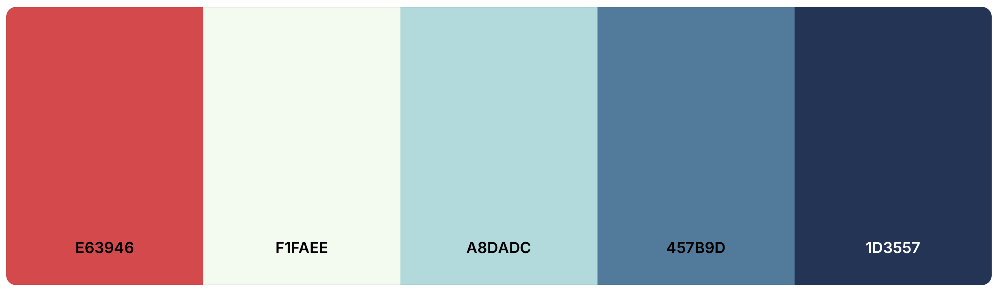

### **Run the solution**:
**Clone github repository:**

```bash
git clone <repository-url>
cd <repository-folder>
```

**Setup local env variables called:** 

create a local .env file in the root of the project, and add these Variable names, and their values

`VITE_OPENAI_API_KEY`
`VITE_GOOD_TAPE_API_KEY`

Run Npm install to install all dependencies

```
npm install
# or
yarn install
```

Run development

```
npm run dev
```

### **Bad excuses (lol)**:
I enjoyed the challenge, although i am not completely satisfied with the result i came up with. I would have liked to use some more time to polish both the visuals and the code itself. Not that it should be a bad excuse, but i had my final exams monday the 20th, so i used some time up to the date to prepare for that and finished most of this solution tuesday the 21st after work...I don't intend it to be a bad excuse, just wanted to mention it.

### **First time using Remix**:
I still wanted to challenge myself even though i was pressed on time, and that is very typical of me, if i find something interesting, i love diving into it and try stuff out. I will probably not have done everything based on the best practices, but i love trying new things, failing alot, pulling my hair out, until i find a solution. That feeling of completion og success at least, is one of the best i think.

### **Side quests**:
I chose to work on the following side-quests.
- `5. Custom Feature`
- `1. Styling Challenge`
- `3. Implement voice output for the jokes`

### **5. Custom Feature**:
I thought it would be fun to try and work with an AI that would be able to take a full conversation from the trascript text or a full sentence, and boil that down into one single word that incompases the theme of the sentence. So for example a user being able to say "Can you tell me a joke about a spider?" And then the AI would take that transcript and boil it down to the most important word in that sentence, and use that as a search term for the joke API.

### **1. Styling Challenge**:
I love styling and designing, and that's also one of the reasons i am not fully satisfied with this particular solution. I used a color pallete from [coloo](https://coolors.co) And added the colors i knew i needed to use to the tailwind.config.ts so i had easy access to then throughout the solution.
```typescript  
colors: {
    color: {
      1: '#F1FAEE',
      2: '#A8DADC',
      3: '#457B9D',
      4: '#1D3557',
      5: '#E63946',
    },
      }
```



### **3. Implement voice output for the jokes**:
I wanted to try and implement this way of outputting the text to speech, since it felt like a good feature to work on when the user is able to speak to get the jokes, they should also be able to take the text and get it read to them. My thought was to actually be able to take the text, and have a selector to choose a language, available from the speechSynthesis library, take the text and translate it and then get it read in another alnguage, but i simply didn't have the time. But that would be a cool and fun deature to try and work on.
